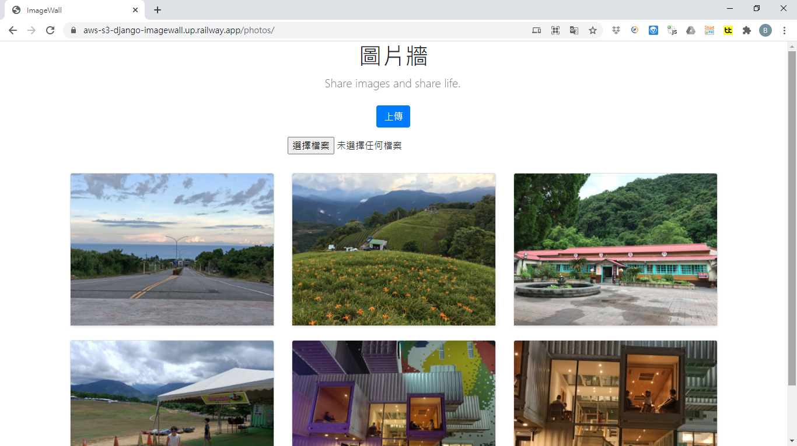

<h1 align="center">Django image wall integrating Amazon S3 cloud service</h1>

  <a href="https://aws-s3-django-imagewall.up.railway.app/photos"><strong>Explore the website</strong></a>
   

## Table of contents

- [About the Project](#about-the-project)
- [Project Implementation and Deployment](#project-implementation-and-deployment)
- [Application execution screenshot](#application-execution-screenshot)

## About the project

The django image wall website uses the django framework and Python's Pillow image library to develop the function of uploading images.This project integrates Amazon S3 cloud service and stores uploaded image files in Amazon S3 buckets to improve data storage flexibility.

## Project Implementation and Deployment

Project implementation mainly uses the following packages:

- django
- django-storages
- Pillow
- boto3
- whitenoise

The project is deployed on the railway platform.

## Application execution screenshot

